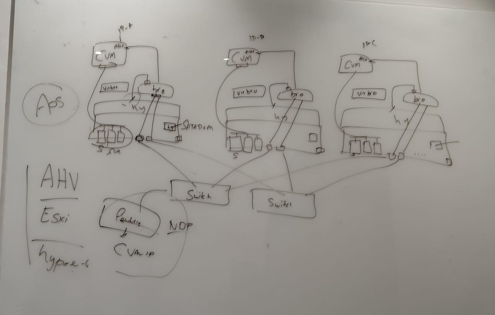

**Processers:**
```
CPU 
GPU
DPU - data processing card
* Networking
* Security
* Storage acceleration
* Reduces CPU load
Common in modern Nutanix + NVIDIA BlueField setups

```
```
About AHV  -   AOS (Acropolis OS)
Storage OS
Runs inside CVM

Responsibilities:
Disk management (HDD / SSD / NVMe)
Replication
Snapshots
Erasure Coding

Compression & Dedup
👉 AOS ≠ Hypervisor
👉 AOS = Storage layer
```

```
AHV (Acropolis Hypervisor)

Nutanix’s native KVM-based hypervisor
Free (no license cost)

Handles:
VM lifecycle
CPU & memory scheduling
Networking (Linux bridges / OVS)
👉 AHV ≈ ESXi alternative
```
```
CVM (Controller VM)

A special VM on every node
Runs AOS

Handles:
All local disks
Storage I/O for VMs
One CVM per node → forms Nutanix Distributed Storage Fabric (DSF)
👉 VM → AHV → CVM → Physical Disks
```

```
AOS - for storage we use AOS to be installed
AHV - Is a hypervisor
CVM - is used to handle the disks - hdd's , ssd's
SATA DOM    - It will have a raid config

ESXI = Switch and AHV = Bridge [ vir-bro , bro ]

br0 without ip = bridge
br0 with ip is = hypervisor
```
