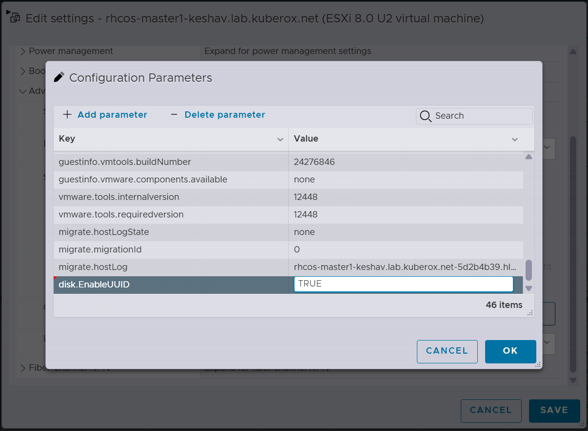
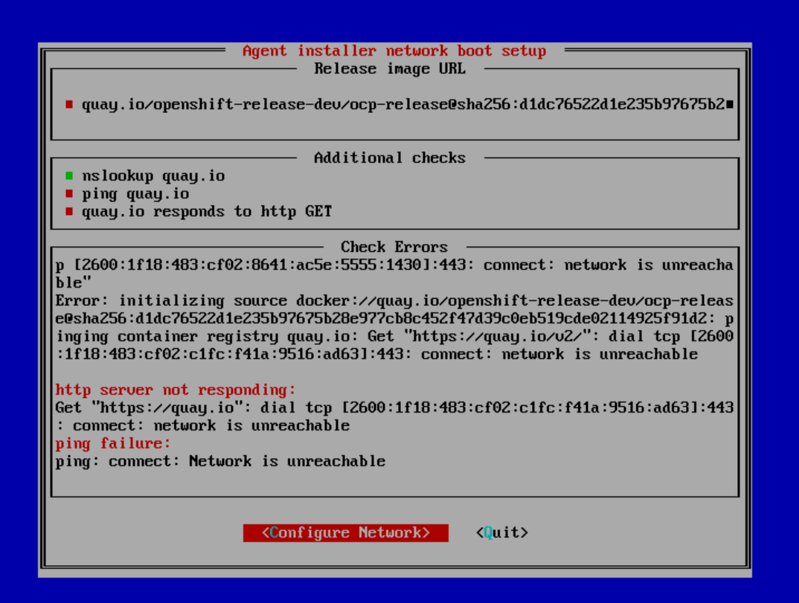
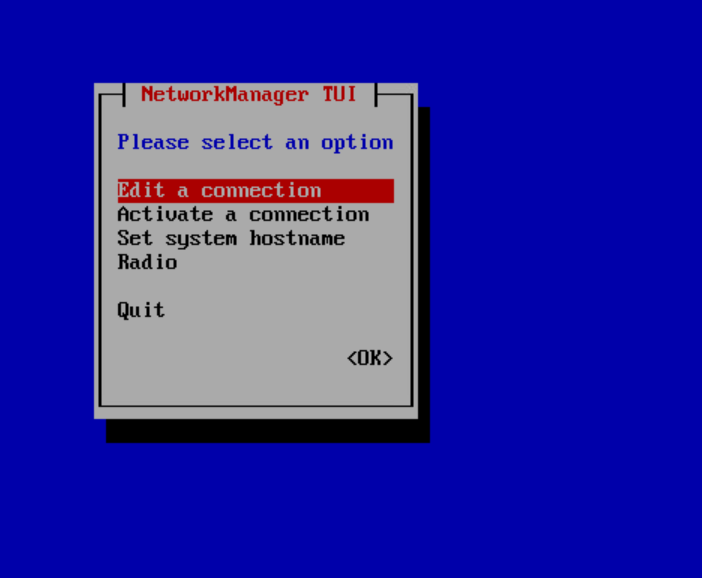
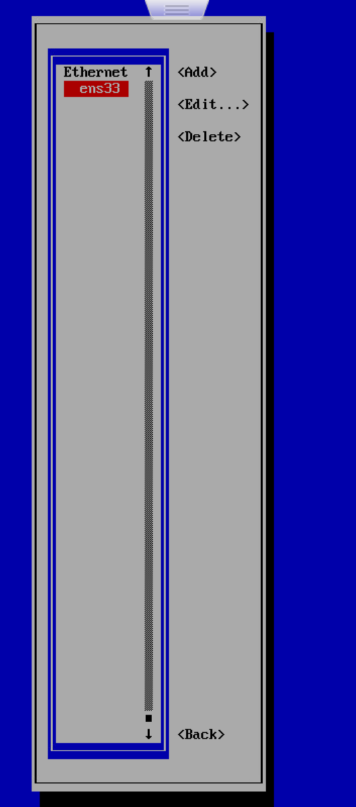
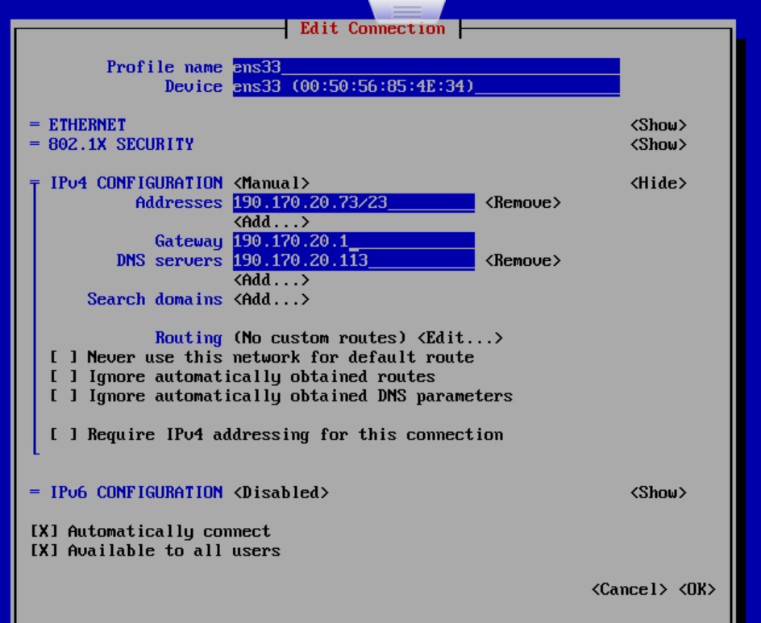
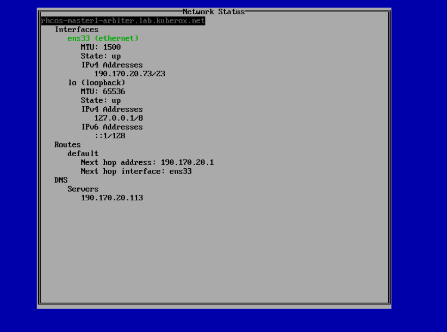
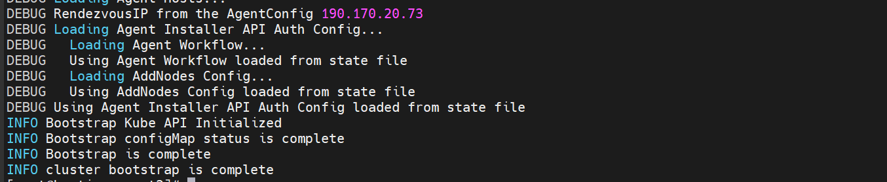

**agent based config file**
```
apiVersion: v1beta1
kind: AgentConfig
metadata:
  name: arbiter

# Master-1 IP acts as bootstrap (rendezvous)
rendezvousIP: 190.170.20.73

additionalNTPSources:
  - 190.170.20.113

hosts:
  - hostname: rhcos-master1.arbiter.lab.kuberox.net
    role: master
    interfaces:
      - name: ens33
        macAddress: 00:50:56:85:4e:34
#    rootDeviceHints:
#      deviceName: /dev/nvme0n1
    networkConfig:
      interfaces:
        - name: ens33
          type: ethernet
          state: up
          mac-address: 00:50:56:85:4e:34
          ipv4:
            enabled: true
            address:
              - ip: 190.170.20.73
                prefix-length: 23
            dhcp: false
      dns-resolver:
        config:
          server:
            - 190.170.20.113

  - hostname: rhcos-master2.arbiter.lab.kuberox.net
    role: master
    interfaces:
      - name: ens33
        macAddress: 00:50:56:85:83:0e
#    rootDeviceHints:
#      deviceName: /dev/nvme0n1
    networkConfig:
      interfaces:
        - name: ens33
          type: ethernet
          state: up
          mac-address: 00:50:56:85:83:0e
          ipv4:
            enabled: true
            address:
              - ip: 190.170.20.74
                prefix-length: 23
            dhcp: false
      dns-resolver:
        config:
          server:
            - 190.170.20.113

  - hostname: rhcos-arbiter.arbiter.lab.kuberox.net
    role: arbiter
    interfaces:
      - name: ens33
        macAddress: 00:50:56:85:33:e9
#    rootDeviceHints:
#      deviceName: /dev/nvme0n1
    networkConfig:
      interfaces:
        - name: ens33
          type: ethernet
          state: up
          mac-address: 00:50:56:85:33:e9
          ipv4:
            enabled: true
            address:
              - ip: 190.170.20.75
                prefix-length: 23
            dhcp: false
      dns-resolver:
        config:
          server:
            - 190.170.20.113

```

**Add Pull secret + agent file + install config in the same folder**
```
vi install-config.yaml

apiVersion: v1
baseDomain: lab.kuberox.net
metadata:
  name: arbiter
compute:
  - architecture: amd64
    hyperthreading: Enabled
    name: worker
    platform: {}
    replicas: 0
controlPlane:
  architecture: amd64
  hyperthreading: Enabled
  name: master
  platform:
    baremetal: {}
  replicas: 2
arbiter:
  architecture: amd64
  hyperthreading: Enabled
  replicas: 1
  name: arbiter
  platform:
    baremetal: {}
networking:
  networkType: OVNKubernetes
  machineNetwork:
  - cidr: 190.170.20.0/23
  clusterNetwork:
  - cidr: 10.128.0.0/14
    hostPrefix: 23
  serviceNetwork:
    - 172.30.0.0/16
platform:
  baremetal:
    hosts:
      - name: cluster-master-0
        role: master

      - name: cluster-master-1
        role: master

      - name: cluster-arbiter-0
        role: arbiter
pullSecret: '{"auths":{"cloud.openshift.com":{"auth":"b3BlbnNoaWZ0LXJlbGVhc2UtZGV2K29jbV9hY2Nlc3NfNjkyNGM3MTQyNzVjNGM0ZGFiZjcwMTRkNTVhM2M2MWI6RkVPVjBFOVBZSUVJODFVUUI4WVRaSEI3NkRIT0VWVE9ZNFZUVVgxOVQ4MVpKSUZSMFhZOVhBUzlDVTUzNFo2MQ==","email":"chennakesavulu@kuberox.com"},"quay.io":{"auth":"b3BlbnNoaWZ0LXJlbGVhc2UtZGV2K29jbV9hY2Nlc3NfNjkyNGM3MTQyNzVjNGM0ZGFiZjcwMTRkNTVhM2M2MWI6RkVPVjBFOVBZSUVJODFVUUI4WVRaSEI3NkRIT0VWVE9ZNFZUVVgxOVQ4MVpKSUZSMFhZOVhBUzlDVTUzNFo2MQ==","email":"chennakesavulu@kuberox.com"},"registry.connect.redhat.com":{"auth":"fHVoYy1wb29sLWJmZTBkMjhiLTcxNWItNDMzNS05NGRjLTdlYTQ4ZTE4NWIyOTpleUpoYkdjaU9pSlNVelV4TWlKOS5leUp6ZFdJaU9pSTBZVGRqWWpka05UZG1PRGcwT0dNMk9ESXpObVpsT0RkaFl6a3lNV0ppTXlKOS5CMVhBZjBLXzNhTzdLVHMxLXVsb1BuLUllZ1QtazFJY1RodzU1dS1vcGNvMlViMTg4b2IxT0xHSDd2Tm5KZTU0WEpDVnVIZXJNYmdZbFV0S0dtakg3bi1WdzcyMkdVY1UycDVIcEFwdGRuY1QxZk1aai1uaGlDY0U5eEc3MzNZcXAycWpyQ3FUSWdmWVNfZkRkTGxQa3EtUTVSOXEwenc3ZHQ0c09jX2ZuMzRuYW9hSjNoNGsxSkcyNkhTeTI3RWlqdkxXNThOSFN1R0FKeUhmN3ctUnNmVXQ3Q09qMDlQQzB1RVVzZnhOTktRUkVJMXpZMVdIT3UwemdkVzNNMGNqT09fRDVDMlFsMDVYcmFWV2huUUt4d1BqVmtHa3N3bnJqSXBIcU1JY0VzUFNlbnFGQjFNclFiMkQxclFES0E4bU5QR21EZTNKdGNvdkNYYnlrUGdMRm1DNnZrMEMzU0ZPLWY0WUpUMmNUZ29GQVBHVE1iVXE1ZnZGMHlzek1pU0tENzJuVU5ZemxFLW5yMlhJSDlMbXVjTnEwMnNuZENFWVJZbmZBUWVXemc5SF9XOTdTY29iNjR1eFpkS090UFJXcDdBenpTWHRLMm9hQVFPUVpPTkwtc2lab3ZCUF9KSUx2NkpaaElQWnNsbWJ1UjZ4M0pTc1dNTndEWnlCN3ZEUWhIX2Y3SzNzVnZtbXphTXJCdTFOVWxRNURaNm9zbV9LQngwZUFiVE91d19LNGRiZU9jSmljenRYYUdHMmlpLWpkQXRyVUh0QnB3R0ZQRHVHTEE5ZVdoQVlmX29Fb3hJYjZqUlpVMUNhVVpVV3FGUzZtTWJRT0RDQVhrbVB6eTB3TnVtRmZHTkdkN05BQXlYQ1E3aVpSMUtoMTFZSFloUFZJc21PWDJuczl2aw==","email":"chennakesavulu@kuberox.com"},"registry.redhat.io":{"auth":"fHVoYy1wb29sLWJmZTBkMjhiLTcxNWItNDMzNS05NGRjLTdlYTQ4ZTE4NWIyOTpleUpoYkdjaU9pSlNVelV4TWlKOS5leUp6ZFdJaU9pSTBZVGRqWWpka05UZG1PRGcwT0dNMk9ESXpObVpsT0RkaFl6a3lNV0ppTXlKOS5CMVhBZjBLXzNhTzdLVHMxLXVsb1BuLUllZ1QtazFJY1RodzU1dS1vcGNvMlViMTg4b2IxT0xHSDd2Tm5KZTU0WEpDVnVIZXJNYmdZbFV0S0dtakg3bi1WdzcyMkdVY1UycDVIcEFwdGRuY1QxZk1aai1uaGlDY0U5eEc3MzNZcXAycWpyQ3FUSWdmWVNfZkRkTGxQa3EtUTVSOXEwenc3ZHQ0c09jX2ZuMzRuYW9hSjNoNGsxSkcyNkhTeTI3RWlqdkxXNThOSFN1R0FKeUhmN3ctUnNmVXQ3Q09qMDlQQzB1RVVzZnhOTktRUkVJMXpZMVdIT3UwemdkVzNNMGNqT09fRDVDMlFsMDVYcmFWV2huUUt4d1BqVmtHa3N3bnJqSXBIcU1JY0VzUFNlbnFGQjFNclFiMkQxclFES0E4bU5QR21EZTNKdGNvdkNYYnlrUGdMRm1DNnZrMEMzU0ZPLWY0WUpUMmNUZ29GQVBHVE1iVXE1ZnZGMHlzek1pU0tENzJuVU5ZemxFLW5yMlhJSDlMbXVjTnEwMnNuZENFWVJZbmZBUWVXemc5SF9XOTdTY29iNjR1eFpkS090UFJXcDdBenpTWHRLMm9hQVFPUVpPTkwtc2lab3ZCUF9KSUx2NkpaaElQWnNsbWJ1UjZ4M0pTc1dNTndEWnlCN3ZEUWhIX2Y3SzNzVnZtbXphTXJCdTFOVWxRNURaNm9zbV9LQngwZUFiVE91d19LNGRiZU9jSmljenRYYUdHMmlpLWpkQXRyVUh0QnB3R0ZQRHVHTEE5ZVdoQVlmX29Fb3hJYjZqUlpVMUNhVVpVV3FGUzZtTWJRT0RDQVhrbVB6eTB3TnVtRmZHTkdkN05BQXlYQ1E3aVpSMUtoMTFZSFloUFZJc21PWDJuczl2aw==","email":"chennakesavulu@kuberox.com"}}}'
sshKey: 'ssh-rsa AAAAB3NzaC1yc2EAAAADAQABAAABgQCnJX3AKwUm5Aq6R8h4VyCOwsUzWvXDAVUH1RzvdebK+0SnTa26xaUNXEqzpo2x3QlZnBNqxVJnRPX0Y5VAWZGWRarARPYz2ox2aFVDydpwr1dtiZCbBUzEZUlq6AEIhMAtfEUHuhzt1mqTGm6vb3qCCTx74arLcsfjD4XX/1cpf6guAcW6OAprwT1pfngdSRmvODeysYAClHPvqHjHp0Y+m9yQMlAsDokdLJSfxb67N2ctwXDBwdT400FR/Ev2cu5joXKp/nx6qH0vpbbVUGo4j0wGLsITUe/4BpVy4BsVyr0/xAVX2mDpqtRD8mAl0OvBJb3D1HcWzzQY0/ky972cHKOeQANao4qwtUft74d3TvqHId5wEG5HUwG3CZW2FNizYGchLRIK69jBOBHyP2BNvGSATHHEmizmNATJZi+/XhRaRHSeeNQ6ouDwcK4APVYs+ZHfwP+3x9RmAa8fFR8qRLDZ0L/fpaiBFl7GLdo6nSenUQnRXDiGeF0VhN3NC4M= root@bastion.arbiter.lab.kuberox.net'

```
**Intsall Required Packages**
```
wget https://mirror.openshift.com/pub/openshift-v4/clients/ocp/4.20.0/openshift-client-cp/4.20.0/openshift-install-linux-4.20.0.tar.gz

wget https://mirror.openshift.com/pub/openshift-v4/clients/ocp/4.20.0/openshift-install-linux-4.20.0.tar.gz

tar -xzvf openshift-client-linux-4.20.0.tar.gz
tar -xzvf openshift-install-linux-4.20.0.tar.gz

cp kubectl oc openshift-install /usr/local/bin/
cp kubectl oc openshift-install /usr/local/sbin/

oc version
oc openshift-install version
```
**Setup DNS forward**
```
cat /var/named/dns.db

$TTL 1W
@       IN      SOA     ns1.arbiter.lab.kuberox.net.   root.arbiter.lab.kuberox.net (
                        202304      ; serial
                        3H              ; refresh (3 hours)
                        30M             ; retry (30 minutes)
                        2W              ; expiry (2 weeks)
                        1W )            ; minimum (1 week)
        IN      NS      ns1.arbiter.lab.kuberox.net.
;
;
ns1.arbiter.lab.kuberox.net.     IN      A       190.170.20.113
;
; The api points to the IP of your load balancer
api             IN      A       190.170.20.76
api-int         IN      A       190.170.20.76
;
; The wildcard also points to the load balancer
*.apps          IN      A       190.170.20.77
;
; Create entry for the bootstrap-arbiter.lab-08 host
bastion         IN      A       190.170.20.113
;
; Create entries for the master hosts
rhcos-master1         IN      A       190.170.20.73
rhcos-master2         IN      A       190.170.20.74
;  Create entries for the worker hosts
rhcos-arbiter       IN      A       190.170.20.75

;EOF

```
**Setup Reverse DNS**
```
cat /var/named/dns-rev.db

$ORIGIN 20.170.190.in-addr.arpa.
$TTL 1W
@       IN      SOA     ns1.arbiter.lab.kuberox.net.       root.arbiter.lab.kuberox.net (
                        202304  ; serial
                        3H      ; refresh (3 hours)
                        30M     ; retry (30 minutes)
                        2W      ; expiry (2 weeks)
                        1W )    ; minimun (1 week)
        IN      NS      ns1.arbiter.lab.kuberox.net.
;
76     IN      PTR     api.arbiter.lab.kuberox.net.
76     IN      PTR     api-int.arbiter.lab.kuberox.net.
;
;
113     IN      PTR     bastion.arbiter.lab.kuberox.net.
;
73     IN      PTR     rhcos-master1.arbiter.lab.kuberox.net.
74     IN      PTR     rhcos-master2.arbiter.lab.kuberox.net.
75     IN      PTR     rhcos-arbiter.arbiter.lab.kuberox.net.
;
;EOF
```

**add them in zone files as shown in below**
```
cat /etc/named.conf

//
// named.conf
//
// Provided by Red Hat bind package to configure the ISC BIND named(8) DNS
// server as a caching only nameserver (as a localhost DNS resolver only).
//
// See /usr/share/doc/bind*/sample/ for example named configuration files.
//

options {
        listen-on port 53 { any; };
        listen-on-v6 port 53 { ::1; };
        directory       "/var/named";
        dump-file       "/var/named/data/cache_dump.db";
        statistics-file "/var/named/data/named_stats.txt";
        memstatistics-file "/var/named/data/named_mem_stats.txt";
        secroots-file   "/var/named/data/named.secroots";
        recursing-file  "/var/named/data/named.recursing";
        allow-query     { any; };

        /*
         - If you are building an AUTHORITATIVE DNS server, do NOT enable recursion.
         - If you are building a RECURSIVE (caching) DNS server, you need to enable
           recursion.
         - If your recursive DNS server has a public IP address, you MUST enable access
           control to limit queries to your legitimate users. Failing to do so will
           cause your server to become part of large scale DNS amplification
           attacks. Implementing BCP38 within your network would greatly
           reduce such attack surface
        */
        recursion yes;

        dnssec-validation yes;

        managed-keys-directory "/var/named/dynamic";
        geoip-directory "/usr/share/GeoIP";

        pid-file "/run/named/named.pid";
        session-keyfile "/run/named/session.key";

        /* https://fedoraproject.org/wiki/Changes/CryptoPolicy */
        include "/etc/crypto-policies/back-ends/bind.config";
};

logging {
        channel default_debug {
                file "data/named.run";
                severity dynamic;
        };
};

zone "." IN {
        type hint;
        file "named.ca";
};
zone "arbiter.lab.kuberox.net" IN {
        type master;
        file "dns.db";
};
#
zone "20.170.190.in-addr.arpa." IN {
        type master;
        file "dns-rev.db";
};
#
include "/etc/named.rfc1912.zones";
include "/etc/named.root.key";

```

** Add Haproxy config file**
```
cat /etc/haproxy/haproxy.cfg
global
  log         127.0.0.1 local2
  pidfile     /var/run/haproxy.pid
  maxconn     4000
  daemon
defaults
  mode                    http
  log                     global
  option                  dontlognull
  option http-server-close
  option                  redispatch
  retries                 3
  timeout http-request    10s
  timeout queue           1m
  timeout connect         10s
  timeout client          1m
  timeout server          1m
  timeout http-keep-alive 10s
  timeout check           10s
  maxconn                 3000
listen api-server-6443
  bind *:6443
  mode tcp
  option  httpchk GET /readyz HTTP/1.0
  option  log-health-checks
  balance roundrobin
  server master1 rhcos-master1.arbiter.lab.kuberox.net:6443 weight 1 verify none check check-ssl inter 10s fall 2 rise 3
  server master2 rhcos-master2.arbiter.lab.kuberox.net:6443 weight 1 verify none check check-ssl inter 10s fall 2 rise 3
  server arbiter rhcos-arbiter.arbiter.lab.kuberox.net:6443 weight 1 verify none check check-ssl inter 10s fall 2 rise 3
listen machine-config-server-22623
  bind *:22623
  mode tcp
  server master1 rhcos-master1.arbiter.lab.kuberox.net:22623 check inter 1s
  server master2 rhcos-master2.arbiter.lab.kuberox.net:22623 check inter 1s
  server arbiter rhcos-arbiter.arbiter.lab.kuberox.net:22623 check inter 1s
listen ingress-router-443
  bind *:443
  mode tcp
  balance source
  server master1 rhcos-master1.arbiter.lab.kuberox.net:443 check inter 1s
  server master2 rhcos-master2.arbiter.lab.kuberox.net:443 check inter 1s
  server arbiter rhcos-arbiter.arbiter.lab.kuberox.net:443 check inter 1s
listen ingress-router-80
  bind *:80
  mode tcp
  balance source
  server master1 rhcos-master1.arbiter.lab.kuberox.net:80 check inter 1s
  server master2 rhcos-master2.arbiter.lab.kuberox.net:80 check inter 1s
  server arbiter rhcos-arbiter.arbiter.lab.kuberox.net:80 check inter 1s
#stats
listen stats
    bind *:9000
    stats uri /stats
    stats refresh 1000ms

```

**Install nmstate on bastion (RECOMMENDED)**
```
sudo dnf install -y nmstate
```

**Now run the below command to generate the iso image**
```
openshift-install agent create image
```
**Before Booting into vm**
```
add in parameter for all the nodes

disk.EnableUUID = TRUE
```


**After Booting the iso**
```
edit config
add gateway and save and exit 
```





**click**
``` 
cntrl + c
Booting will start now and it will pull required images.
```

**Validate the updats when we run the below commands**
```
openshift-install agent wait-for bootstrap-complete --log-level=debug
openshift-install agent wait-for bootstrap-complete --log-level=info
```

```
if any issue faced during the booting like failue ssh into that node and type:

journalctl -xe -f
```

```
https://docs.redhat.com/en/documentation/openshift_container_platform/4.20/html-single/installing_an_on-premise_cluster_with_the_agent-based_installer/index#installing-ocp-agent-tui_installing-with-agent-based-installer
```